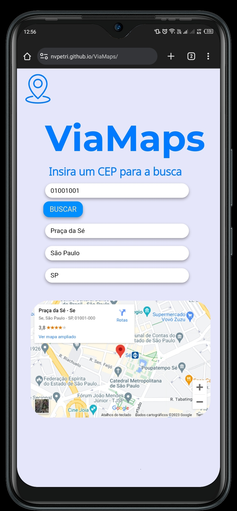

# 

 Seja bem vindo ao projeto ViaMaps!

 Projeto desenvolvido por Nicolas Vasconcelos Petri Santos 

### Tópicos
- [Descrição do projeto](#descrição-do-projeto)
- [Funcionalidades](#funcionalidades)
- [Aplicação Desktop](#aplicação-desktop)
- [Aplicação Responsiva](#aplicação-responsiva)
- [Ferramentas Utilizadas](#ferramentas-utilizadas)
- [Acesso ao projeto](#acesso-ao-projeto)

## Descrição do projeto

 Projeto desenvolvido para a matéria de Programação Web Front-End do curso de Desenvolvimento de Sistemas no Senai Jandira, orientado pelo Professor Fernando Leonid. O projeto <strong>ViaMaps</strong> foi desenvolvido com o intuito de praticar o consumo de dados via <strong>API's</strong> e estrutura básica do <strong>JavaScript</strong> 

## Funcionalidades

<strong>Funcionalidade 1:</strong> Permitir que o usuário digite o CEP para realizar a busca 

<strong>Funcionalidade 2:</strong> Mostrar as informações acerca do CEP inserido

<strong>Funcionalidade 3:</strong> Mostrar a localização no Mapa

## Aplicação Desktop

## Aplicação Responsiva

## Ferramentas Utilizadas

## Acesso ao projeto

A página está disponivel via GitHub Pages no link: <a>https://nvpetri.github.io/ViaMaps/</a>

